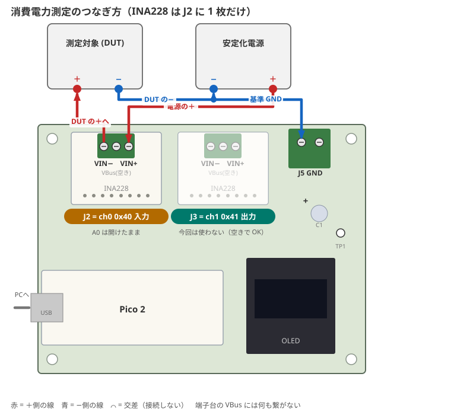
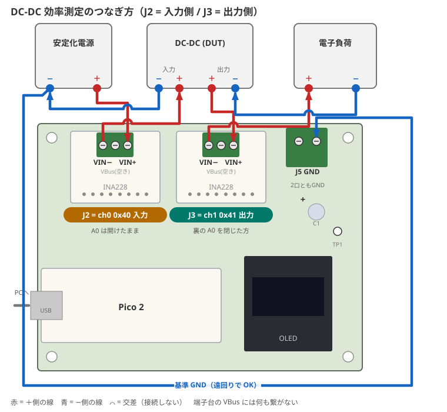
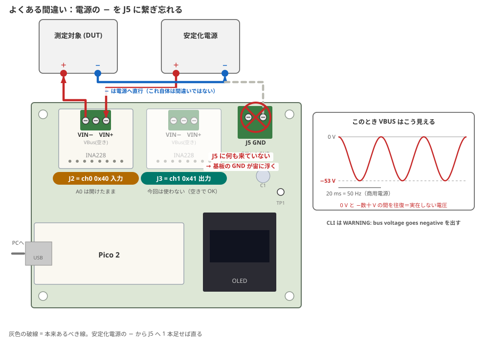
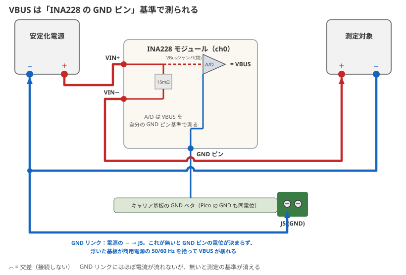

# picowatt キャリア基板

Pico 2 + INA228 ×2 + SSD1306 OLED を 1 枚に載せるキャリア基板。ロジックはすべて
I2C0 にぶら下がるだけなので、この基板は **電源と I2C を配るだけ** で能動素子を持たない。

- 基板サイズ **92 × 70 mm**（2 層、厚さ 1.6mm）。100×100mm 以内なので各社の最安枠に収まる
- 子基板（Pico 2 / INA228 ×2 / OLED）はすべて 2.54mm ソケットで着脱可能
- 高さはすべて **11.0mm の同一面** に揃う（ソケットのハウジング高さ 8.5mm +
  ピンヘッダのハウジング厚み 2.5mm、いずれも秋月の仕様値）

KiCad 10 で `picowatt-carrier.kicad_pro` を開く。シンボルとフットプリントのうち
本基板固有のものは `picowatt.kicad_sym` / `picowatt.pretty/` にプロジェクト内蔵。
残りは KiCad 標準ライブラリを参照する。

> KiCad を一度も起動していない環境ではグローバルライブラリテーブルが未作成のため、
> 標準ライブラリ参照がエラーになる。KiCad を一度起動すれば自動生成される。

## 配置の考え方

配線の向きを 3 方向に分離してある。

| 方向 | 出ていくもの |
|---|---|
| 上辺（奥） | INA228 ×2 のネジ端子台、GND 端子台 — 太い電源線はすべて奥へ |
| 左辺 | Pico 2 の Micro-USB B — PC へ |
| 手前 | OLED の表示面 |

INA228 の端子台が基板の外を向くので、電源線は基板の上を這わない。

J5 (GND 端子台) も同じ向きに揃えるため **180° 回転して配置してある。** TB007-508 の
機械図面 (SECTION A-A) では、ピン列は電線挿入面ではなく**背面から 4.90mm**（挿入面からは
5.35mm）の位置にある。回転 0 のままだと電線が手前から入り、基板の上をまたぐことになる。

## 回路

ネットは 6 本だけ。

| ネット | 接続先 |
|---|---|
| `+3V3` | Pico 2 pin36 (3V3 OUT) → INA228 ×2 の VIN、OLED VDD、プルアップ、パスコン |
| `GND` | Pico 2 の GND 群、各子基板 GND、GND 端子台、TP1 |
| `SDA` | Pico 2 GP4 (pin 6) → INA228 ×2、OLED |
| `SCL` | Pico 2 GP5 (pin 7) → INA228 ×2、OLED |
| `ALRT0` | Pico 2 GP6 (pin 9) → INA228 ch0 の ALRT |
| `ALRT1` | Pico 2 GP7 (pin 10) → INA228 ch1 の ALRT |

`ALRT0` / `ALRT1` は現ファームウェアでは未使用だが、`firmware/src/config.h` が
GP6/GP7 を予約済みで配線コストがゼロなので引いてある。INA228 側の ALRT は
オープンドレインなのに基板上にプルアップが無いため、R1/R2 (10kΩ) を本基板に載せる。

I2C プルアップは INA228 が各 10kΩ を持ち、2 枚並列で 5kΩ、さらに OLED モジュール分も
乗るので追加不要と判断した。R3/R4 は**未実装** (DNP) のパッドとして用意してあるだけで、
1MHz で波形が鈍る場合にのみ実装する。

### 電力ラインは基板に通さない

INA228 の 2.54mm ヘッダには `VBUS` / `VIN-` / `VIN+` も出ているが、**基板側は無接続**に
してある（J2/J3 の pin 5,6,7）。最大 5A の電力ラインをキャリア基板に通す理由がないため、
電源線は従来通り INA228 自身のネジ端子台に接続する。

> **注意**: 無接続とはいえ、このパッドには測定対象の電源電位（最大 30V）が乗る。
> シルクにも警告を入れてある。

## 部品表

Pico 2 / INA228 ×2 / OLED 以外はすべて秋月電子で揃う。**通販コードと寸法は商品ページで
実際に確認済み**（確認できなかった項目は末尾に明記）。

### 基板に実装するもの

| 通販コード | 品名 | 型番 | 単価 | 入数 | 必要 | Ref / 適合確認 |
|---|---|---|---|---|---|---|
| [103077](https://akizukidenshi.com/catalog/g/g103077/) | ピンソケット(メス) 1×20 | FH-1x20 | ¥50 | 1個 | 2 | J1。ピッチ2.54 / 高さ8.5mm |
| [103785](https://akizukidenshi.com/catalog/g/g103785/) | ピンソケット(メス) 1×8 | FH-1x8SG/RH | ¥30 | 1個 | 2 | J2,J3。高さ8.5mm |
| [110099](https://akizukidenshi.com/catalog/g/g110099/) | ピンソケット(メス) 1×4 | FH-1x4SG/RH | ¥20 | 1個 | 1 | J4。高さ8.5mm |
| [102333](https://akizukidenshi.com/catalog/g/g102333/) | ターミナルブロック 2P 緑 縦 小 | — | ¥35 | 1個 | 1 | J5。**5.08mmピッチ・水平引出し・ねじ式** |
| [125103](https://akizukidenshi.com/catalog/g/g125103/) | カーボン抵抗 1/4W 10kΩ | RD25S | ¥100 | 1袋100本 | 1袋 | R1,R2。立て実装 |
| [125222](https://akizukidenshi.com/catalog/g/g125222/) | カーボン抵抗 1/4W 2.2kΩ | CF25J2K2B | ¥150 | 1袋100本 | 1袋 | R3,R4。**未実装なので省略可** |
| [117897](https://akizukidenshi.com/catalog/g/g117897/) | 電解コンデンサー 10µF50V ルビコンPX | 50PX10MEFC5X11 | ¥10 | 1個 | 1 | C1。φ5×11mm / **端子間2mm** |
| [110147](https://akizukidenshi.com/catalog/g/g110147/) | 積層セラミックコンデンサー 0.1µF250V X7R | RDER72E104K2K1H03B | ¥25 | 1個 | 1 | C2。**端子間5mm** / 5.5×3.15×4mm |
| [112217](https://akizukidenshi.com/catalog/g/g112217/) | チェック端子 TEST-34 | TEST-34 | ¥15 | 1個 | 1 | TP1。径0.8mm |

小計 **約 ¥585**（2.2kΩ を省けば約 ¥435）。

> C2 を安く済ませたい場合は [112670](https://akizukidenshi.com/catalog/g/g112670/)
> (0.1µF 50V X7R **2.54mm**ピッチ, ¥10) でもよい。基板のパッドは 5mm ピッチなので
> リードを外側へ広げて挿す。小型 MLCC なので実際には問題にならない。

### 子基板側に付けるピンヘッダ

| 通販コード | 品名 | 型番 | 単価 | 必要 | 備考 |
|---|---|---|---|---|---|
| [100167](https://akizukidenshi.com/catalog/g/g100167/) | ピンヘッダー 1×40 | PH-1x40SG | ¥35 | 2 | 切って使う。ハウジング厚み2.5mm |

Pico 2 用に 1×20 ×2、INA228 用に 1×8 ×2 で計 56 ピン。1×40 を 2 本で足りる。
**Pico 2 H（ヘッダ実装済み）を使うなら 1 本でよい。** OLED は多くの場合ヘッダ付属。

### 機構部品

**キャリア側の穴はタップの無い通し穴**（子基板用 φ2.8、四隅 φ3.2）。メス-メスの
スタンドオフを子基板とキャリアで挟み、上下からネジで留める。

**必要な高さは 11.0mm。** ソケットのハウジング高さ 8.5mm + ピンヘッダのハウジング厚み
2.5mm で、どちらも秋月の仕様値。子基板の裏面はキャリア面から 11.0mm に来る。

| 用途 | 通販コード | 品名 | 単価 | 必要 |
|---|---|---|---|---|
| 四隅の脚 | [107313](https://akizukidenshi.com/catalog/g/g107313/) | 六角両メネジ FB3-10 (黄銅 M3 10mm) | ¥30 | 4 |
| 同ネジ | [110329](https://akizukidenshi.com/catalog/g/g110329/) | なべ小ねじ(+) M3×10 | ¥180/10個 | 1袋 |

**M2.5 のスペーサーは秋月では扱っていない**（複数のキーワードで検索して確認）。
子基板用は次のどちらかになる。

- **秋月だけで揃える場合**: [113017](https://akizukidenshi.com/catalog/g/g113017/)
  プラスチックスペーサー M2×10mm ¥20 ×8 +
  [113020](https://akizukidenshi.com/catalog/g/g113020/) なべ小ねじ プラスチック M2×5mm
  ¥10 ×16。M2 は φ2.8 の穴に対して緩いが、スペーサーが厚みを決めるので実用上は問題ない。
  10mm なので 1mm 足りず、ワッシャで詰めるか軽く締める程度にする
- **寸法どおりに揃える場合**: M2.5 メス-メス 11mm を廣杉計器などから調達する

なお子基板は 8pin / 4pin のソケット自体でも保持されるので、**スタンドオフは剛性を上げる
ためのもので必須ではない。** ただし INA228 は端子台をドライバーで締めるため、付けた方がよい。

### 確認していないこと

- `102333` の電線挿入口がフットプリントのどちら向きかは未確認。**J5 は両ピンとも GND なので
  向きは電気的に無関係**で、線を出したい方向に合わせて挿せばよい
- ソケットの推奨実装穴径は 1.02mm、基板の穴は 1.0mm。0.02mm の差はドリル公差の範囲内で、
  一般的な 2.54mm ソケットの実装として標準的な値
- 秋月の在庫状況・価格は 2026-07 時点の商品ページの表示

## 組み立て時の設定

シルクにも印刷してあるが、忘れやすいので再掲。

1. **ソケットとチャンネルの対応**: 左の J2 = ch0 (0x40, 入力側)、右の J3 = ch1
   (0x41, 出力側)。各ソケットの左脇に `ch0 0x40 IN` / `ch1 0x41 OUT` を縦書きで
   印刷してある
2. **ch1 に挿す INA228 は裏の A0 ジャンパを閉じる** → アドレス 0x41
   （ch0 用は開放のまま 0x40）
3. **INA228 ×2 とも裏の VBus ジャンパを閉じる** → ハイサイド測定になる
4. **GND の共通接続は 1 点のみ。** 安定化電源の − は J5 だけに落とす

## 使い方（配線図）

図は実物と同じ向き（USB が左、端子台が上辺）。**赤 = ＋側、青 = −側**。
いずれのモードでも測定電流は INA228 モジュール自身のネジ端子台を通り、
**キャリア基板の信号配線には流れない**（J2/J3 の pin 5-7 は無接続）。

- **J5 の 2 つの口はどちらも GND** で、基板内の両面ベタで繋がっている。
  消費電力測定では DUT の−と電源の−を**別々の口に**挿せばよく、
  線を途中で分岐させる必要はない（2 口間の戻り電流は幅の広いベタを
  約 5mm 通るだけで、サブ mΩ・実害なし）
- 効率測定では電源の−端子に 2 本を共締めする
  （DCDC の IN− を J5 の空き口に挿す形でも同じ）
- **端子台の真ん中のネジ (VBus) には何も繋がない**

### 消費電力測定（INA228 1 枚、ch0 のみ）

INA228 は A0 開放のまま **J2**（左、シルク `ch0 0x40 IN`）に挿す。



### DC-DC 効率測定（INA228 2 枚、ch0 + ch1）

ch1 用の INA228 は裏の A0 を閉じて **J3**（右、シルク `ch1 0x41 OUT`）に挿す。



この結線は **非絶縁 DC-DC**（IN− と OUT− が内部で共通）を前提にしている。
絶縁型を測る場合は ch1 のバス電圧の基準が浮いてしまうので、OUT− 側も
基準電位へ 1 点で接続すること。

### よくある間違い：電源の − を J5 に繋ぎ忘れる

INA228 は VBUS を **自分の GND ピン基準**で測る。GND ピンは基板の GND ベタに
落ちているだけなので、電源の − が J5 に来ていないと基板全体が電源系から浮き、
VBUS が 0 V と −数十 V の間を 50/60 Hz で振動する。電流はそれらしく出るので
気付きにくい。





電源の − から J5 の空き口へ 1 本足せば直る。`picowatt-cli` はこの状態を
`WARNING: bus voltage goes negative` として報告する。他の症状は
[docs/troubleshooting.md](../docs/troubleshooting.md)。

図は `tools/wiring_diagrams.py` が基板と同じ座標データから生成している。

## 配線

2 層、配線 57 本 + ビア 8 個。**未配線 0 件・ERC 0 件**で検証済み
（DRC は後述の回転由来の警告 1 件のみ、実害なし）。

| 層 | 用途 |
|---|---|
| B.Cu | `+3V3` 幹線（Y=42.2mm を横断）+ ベタ GND |
| F.Cu | 信号 4 本 + ベタ GND |

`GND` は両面ベタで配るため配線を持たない。全 GND パッドの導通は、ゾーンを塗った状態で
`pcbnew` の接続性チェックにより確認済み（ベタは分断されていない）。

配線幅は信号 0.3mm、電源 0.4mm。全パッドがスルーホールなので、層をまたぐのは
交差回避の 4 箇所（ビア 8 個）だけ。

### 帯状のレーン構成

バンド（Y 33〜38mm）に 4 本の信号レーンを平行に走らせ、そこから各コネクタへ分岐する。

| ネット | レーン Y | Pico 上側列を抜ける X |
|---|---|---|
| `SDA` | 37.2mm | 13.80mm |
| `SCL` | 36.0mm | 16.34mm |
| `ALRT0` | 34.8mm | 23.96mm |
| `ALRT1` | 33.6mm | 26.50mm |

**Pico 2 の下側列（GP4/5/6/7）から上へ抜けるとき、上側列のパッドの隙間を通している。**
パッド径 1.6mm・ピッチ 2.54mm なのでパッド中心から 1.27mm、銅箔間で 0.32mm 空く。
本基板で最も攻めた箇所だが、各社の下限（0.127mm 程度）に対しては十分な余裕がある。

レーンの上下順は「Pico から抜ける X が左のものほど上のレーン」に揃えてあり、
これにより 4 本の立ち上がりが互いに交差しない。上のレーンを跨がざるを得ない
以下の 4 箇所だけ、B.Cu へ潜って戻している（ビア 2 個 × 4 = 8 個）。

| ネット | X | 跨ぐレーン |
|---|---|---|
| `SCL` | 18.19 | `SDA` |
| `SCL` | 48.19 | `SDA` |
| `ALRT0` | 30.89 | `SCL` と `SDA` |
| `ALRT1` | 60.89 | `SCL` と `SDA` |

### プルアップ抵抗の置き方

R1〜R4 は**配線の通り道の上に直接置いてある**。信号側のパッドは 4 本とも既存の配線上に
乗るので、信号側の引き込み配線は 1 本もない。+3V3 側は裏面に 2.8〜4.2mm のスタブが
3 本あるだけで、R4 は +3V3 の既存配線上に乗るためスタブすら不要。

| Ref | 役割 | 信号側パッドが乗っている配線 |
|---|---|---|
| R1 | `ALRT0` プルアップ | ALRT0 の J2.8 への立ち上がり (X=30.89) |
| R2 | `ALRT1` プルアップ | ALRT1 の J3.8 への立ち上がり (X=60.89) |
| R3 | `SDA` プルアップ (未実装) | SDA の OLED への下り (X=74.81) |
| R4 | `SCL` プルアップ (未実装) | SCL の OLED への下り (X=72.27) |

いずれも配線の途中から分岐する形（直列ではない）なので、**R3/R4 を未実装のままでも
`SDA` / `SCL` は繋がる。**

> 当初は 10.16mm ピッチの抵抗を基板左側に並べていたが、配線してみると信号側パッドが
> 基板左端に来てしまい、先に引いた `SDA` の縦線を必ず跨ぐため層をまたぐ箇所が 5 つ必要になった。
> 2.54mm ピッチの立て実装に変更し、配線経路上へ移動して解消している。

## tools/

この基板は生成スクリプトで作られている。**KiCad ファイルが正であり、これらを再実行すると
上書きされる**ので、レイアウトを作り直すとき以外は触らなくてよい。

| ファイル | 役割 |
|---|---|
| `generate.py` | 部品配置・ネットリスト・ベタ・シルクを含む KiCad プロジェクトを生成 |
| `routes.py` | 配線をキャリア座標のポリラインで定義 |
| `routelib.py` | 基板の読み取り、クリアランス／接続性の事前チェック、配線の書き出し |
| `audit.py` | 保存済み基板から配線を読み直し、実クリアランス余裕を報告 |
| `wiring_diagrams.py` | README 用の配線図 (docs/wiring-*.svg, docs/breadboard-*.svg, docs/vbus-reference.svg) を生成 |

再生成する場合は `generate.py` → `routelib.emit()` → `pcbnew` でゾーン塗り、の順。
`audit.py` は KiCad の DRC とは独立に幾何を検算するので、変更後の確認に使える。

## 発注

2 層・1.6mm・92×70mm。特殊な要求は無いので JLCPCB / PCBWay / Elecrow のいずれでも最安枠。

```sh
kicad-cli pcb export gerbers picowatt-carrier.kicad_pcb -o gerber/
kicad-cli pcb export drill   picowatt-carrier.kicad_pcb -o gerber/
```

## 既知のリスク

**OLED モジュールのロット差。** 秋月 112031 は商品ページに「ロットにより外観が異なります」
と明記されており、秋月が配布している参考 PDF は実物と別基板（PDF は 27.3×27.3mm /
シルク `GND VCC SCL SDA`、実物は 25×27mm / `GND VDD SCK SDA`）。本設計は**実測値**
（外形 25×27mm、取付穴ピッチ 21×23mm、穴径 φ2.75、ヘッダは上辺から 1.5mm）に基づく。

交換品を買う場合は寸法だけでなく **ピンの並び順も必ず確認すること。** この種のモジュールには
`GND` と `VCC` が逆のロットが実在する。取付穴が左右対称 (±10.5mm) なので**逆順品でも機械的には
刺さってしまい、電源を逆接する**。基板は pin1=GND / pin2=VDD 前提。

この事故を防ぐため、**基板のシルクに各パッドのピン名を印刷してある。**

- J4 の 4 パッドの脇に `GND` `VDD` `SCK` `SDA` を縦書きで(モジュールを載せる前、
  はんだ付けの段階で手元のモジュールと突き合わせられる)
- 基板下端に `J4 OLED pin1=GND VDD SCK SDA` を 1 行(モジュール実装後も読める)
- J2/J3 も同様に `VIN GND SCL SDA VBUS VIN- VIN+ ALRT` を各パッド脇に印刷

**回転したフットプリントの `lib_footprint_mismatch` 警告。** J5 は 180° 回転して配置して
あるため、`kicad-cli pcb drc` がこの警告を 1 件出す。回転させたフットプリントであれば
部品を問わず出る kicad-cli 側の比較の癖で（無関係な部品を回して再現確認済み）、
実体は隠しテキストの角度差。製造・機能への影響はない。
